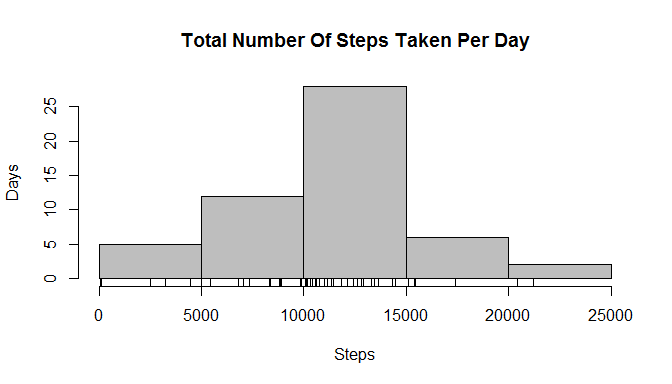
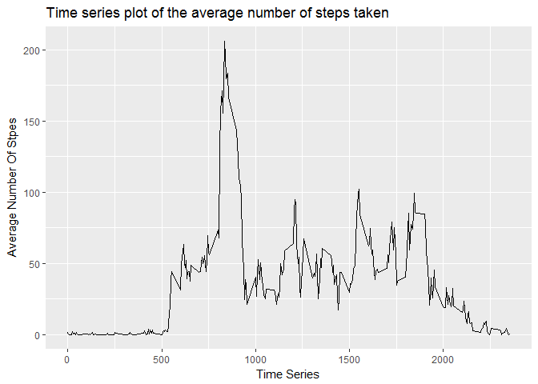
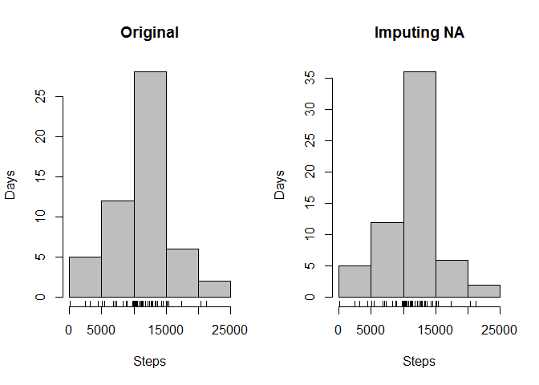
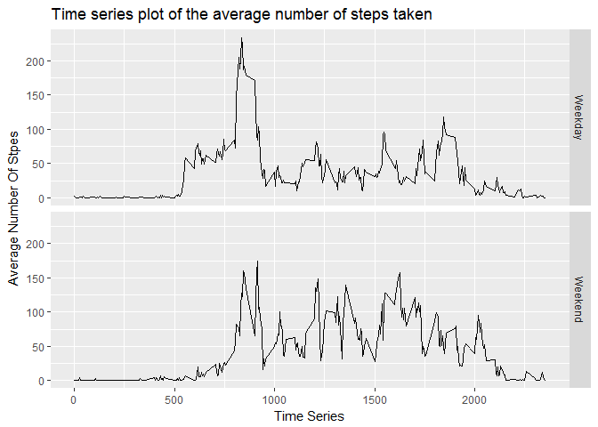

# Reproducible Research: Peer Assessment 1
  
## Loading and preprocessing the data
 1.Load the data (i.e. read.csv())
 2. 2.Process/transform the data (if necessary) into a format suitable for your analysis
unzip the data file and then read data file

```
## 
## Attaching package: 'dplyr'
```

```
## The following objects are masked from 'package:stats':
## 
##     filter, lag
```

```
## The following objects are masked from 'package:base':
## 
##     intersect, setdiff, setequal, union
```

  
## What is mean total number of steps taken per day?
1.Calculate the total number of steps taken per day
2.If you do not understand the difference between a histogram and a barplot, research the difference between them. Make a histogram of the total number of steps taken each day

```r
hist(REPW1Data_df_Sum_By_Date$steps, col="gray", ylab="Days", xlab="Steps", main="Total Number Of Steps Taken Per Day")
rug(REPW1Data_df_Sum_By_Date$steps)
```

<!-- -->

3.Calculate and report the mean and median of the total number of steps taken per day

```r
mean(REPW1Data_df_Sum_By_Date$steps, na.rm=TRUE)
```

```
## [1] 10766.19
```

```r
median(REPW1Data_df_Sum_By_Date$steps, na.rm=TRUE)
```

```
## [1] 10765
```


## What is the average daily activity pattern?
1.Make a time series plot (i.e. type = "l") of the 5-minute interval (x-axis) and the average number of steps taken, averaged across all days (y-axis)

```r
library(ggplot2)
REPW1Data_df_group_By_Time <- group_by(REPW1Data_df, interval)
REPW1Data_df_Mean_By_Time <- summarize(REPW1Data_df_group_By_Time, steps=mean(steps,na.rm=TRUE))
ggplot(REPW1Data_df_Mean_By_Time, aes(interval, steps)) + geom_line() + labs(title = "Time series plot of the average number of steps taken", x="Time Series", y="Average Number Of Stpes")
```

<!-- -->

2.The 5-minute interval that, on average, contains the maximum number of steps 

```r
REPW1Data_df_Mean_By_Time[which.max(REPW1Data_df_Mean_By_Time$steps),]    
```

```
## # A tibble: 1 × 2
##   interval    steps
##      <int>    <dbl>
## 1      835 206.1698
```

## Imputing missing values
1.Calculate and report the total number of missing values in the dataset

```r
    nrow(REPW1Data_df[is.na(REPW1Data_df$steps),])
```

```
## [1] 2304
```
2.Devise a strategy for filling in all of the missing values in the dataset.
  replace to NA value with mean steps in that time
  
3.Create a new dataset that is equal to the original dataset but with the missing data filled in.

```r
NewImputedTbl <- data.frame()
for(i in 1:nrow(REPW1Data_df)){
    valSteps <- REPW1Data_df[i,]
    if(is.na(valSteps$steps)) {
        NewImputedTbl[i,c("steps")] <-subset(REPW1Data_df_Mean_By_Time,interval==valSteps$interval, select="steps")}
    else{
        NewImputedTbl[i, c("steps")] <- valSteps[,"steps"]
        }
}

REPW1Data_df_Imputted <- REPW1Data_df
REPW1Data_df_Imputted$steps <-NewImputedTbl$steps
```

4.Make a histogram of the total number of steps taken each day and Calculate and report the mean and median total number of steps taken per day.

```r
par(mfrow=c(1,2))
# Create Total number of Steps Histogram(Original)
REPW1Data_df_Sum_By_Date <- summarize(REPW1Data_df_group_By_Date, steps=sum(steps))
hist(REPW1Data_df_Sum_By_Date$steps, col="gray", ylab="Days", xlab="Steps", main="Original")
rug(REPW1Data_df_Sum_By_Date$steps)

# Create Total number of Steps Histogram(Imputing missing values)
REPW1Data_df_Imputted_group_By_Date <- group_by(REPW1Data_df_Imputted, date)
REPW1Data_df_Imputted_Sum_By_Date <- summarize(REPW1Data_df_Imputted_group_By_Date, steps=sum(steps))
hist(REPW1Data_df_Imputted_Sum_By_Date$steps, col="gray", ylab="Days", xlab="Steps", main="Imputing NA")
rug(REPW1Data_df_Imputted_Sum_By_Date$steps)
```

<!-- -->

4-1 report the mean and median total number of steps taken per day. Do these values differ from the estimates from the first part of the assignment?  

Answer:mean value is same with first part value, but median value has changed.

```r
mean(REPW1Data_df_Imputted_Sum_By_Date$steps, na.rm=TRUE)
```

```
## [1] 10766.19
```

```r
median(REPW1Data_df_Imputted_Sum_By_Date$steps, na.rm=TRUE)
```

```
## [1] 10766.19
```


## Are there differences in activity patterns between weekdays and weekends?
  
1.Create a new factor variable in the dataset with two levels – “weekday” and “weekend” indicating whether a given date is a weekday or weekend day.

```r
REPW1Data_df_Add_DayType <- REPW1Data_df
REPW1Data_df_Add_DayType$DayType <- ifelse(weekdays(as.Date(REPW1Data_df_Add_DayType$date)) %in% c("Saturday", "Sunday"), "Weekend","Weekday")
REPW1Data_df_Add_DayType$DayType <- as.factor(REPW1Data_df_Add_DayType$DayType)
```

2.Make a panel plot containing a time series plot (i.e. type = "l") of the 5-minute interval (x-axis) and the average number of steps taken, averaged across all weekday days or weekend days (y-axis). See the README file in the GitHub repository to see an example of what this plot should look like using simulated data.

```r
# group by interval
REPW1Data_df_Add_DayType_by_time <- group_by(REPW1Data_df_Add_DayType, interval, DayType)
REPW1Data_df_Add_DayType_Mean_by_time <- summarize(REPW1Data_df_Add_DayType_by_time, steps=mean(steps,na.rm=TRUE))

par(mfrow=c(2,1))
ggplot(REPW1Data_df_Add_DayType_Mean_by_time, aes(interval, steps)) + geom_line() + facet_grid(DayType ~ .) + labs(title = "Time series plot of the average number of steps taken", x="Time Series", y="Average Number Of Stpes")
```

<!-- -->

